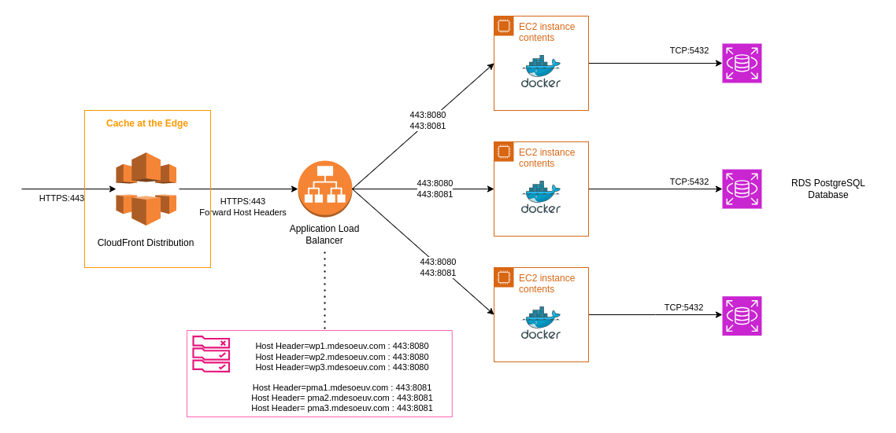

## Cloud-1

_42 School Cloud Project_  

**Goal :** Deploy a resilient Wordpress architecture with a Public Cloud Provider  

**Cloud Provider :** Amazon Web Services    

**Infrastructure as Code :** Terraform  

### Two Architectures

In order to conform with the school subject we designed two different infrastructures in their respective folders  

#### Single domain (Recommended)

- The first one is our recommended design for a real use case : Single Hostname -> CDN + Load Balancer + Auto Scaling Group + RDS Database

- This infrastructure has only one endpoint for Wordpress and one for PhpMyAdmin  
- The traffic is load balanced to multiple EC2 instances (The load balancer will route traffic to healthy instances from the )   

This is the recommended architecture for Wordpress deployment on AWS (See Readme in the single-domain folder)  

#### Multi domains

- The second one is what the subject requires : One different Hostname to reach each instance
- This infrastructure defines endpoints (From 1 to 5 endpoints)  
Each of these endpoints represent one instance of wordpress (wp1, wp2,wp3 ..., wp5.[DOMAIN_NAME]) and one phpmyadmin  

