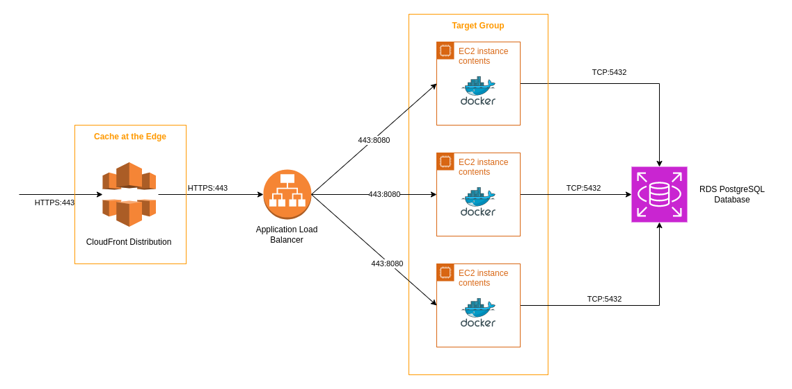

auto scalling group
rds replica standby
Traefik po

### Deployment Architecture

The whole stack is deployed on AWS using the following services  

---
#### AWS Application Load Balancer

The Load Balancer forward traffic to EC2 instances registered in a target group  
Healthchecks are performed in order to route traffic only to healthy instances  

##### Setup

- Listener Port : 443
- Target Port : 8080 (Worpress on EC2)
- Ingress : * / CloudFront
- Egress : EC2 Security Group

---
#### AWS EC2 Instances

AWS Virtual Machine running on Amazon Linux 2023  
Wordpress runs on docker and connects to the database on port 3306

##### Setup

- Amazon Linux 2023
- Type : t2.micro
- Ingress : ALB Security Group
- Egress : * / RDS Security Group on port 3306

---
#### AWS RDS Database

RDS is a database service that uses a managed underlying instance  

##### Setup

- MariaDB version 10.6.14
- Ingress : EC2 Security Group on port 3306

---
#### AWS CloudFront Distribution

CloudFront is a CDN distribution that provides caching capabilities at AWS Edge Locations  
The traffic is forwarded to the CloudFront origin set as the Load Balancer (including headers)  

- CloudFront cache invalidation : `aws cloudfront create-invalidation --distribution-id distribution_ID --paths "/*"`

---
### Infrastructure as Code / Terraform code

- The stack is deployed with Terraform, providing state management and automating API calls to AWS Services  

- Terraform will automate the creation of CNAME Records with our Subdomains owned by IONOS  

#### Setup

- Create a `terraform.tfvars` based on the `terraform-tfvars.model` file to provide variables
- Create a `app/.env` file based on the `.env.sample` to provide environment variables to the docker-compose stack 
- Place valid SSL Certificates in the `terraform/ssl` folder

