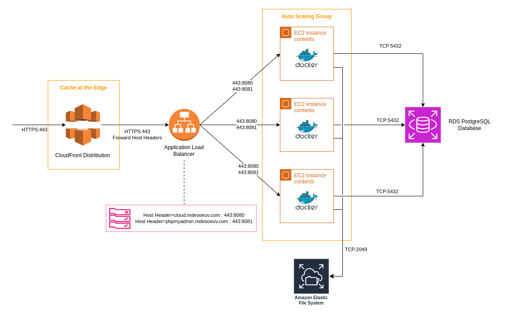
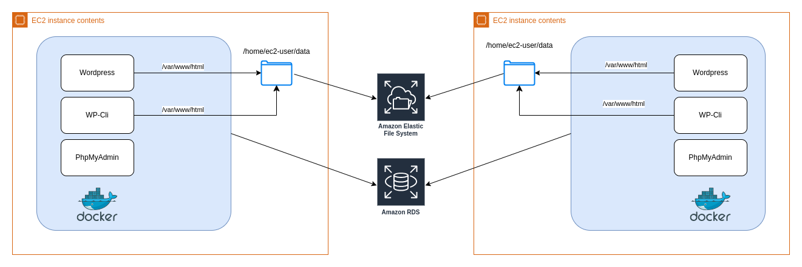

To Do :

- [-] : Test new articles are visible on 2 instances (with images)
- [ ] : Retrain CloudFront cache to specific file types (.css, .jpg, etc...) Mehdi
- [-] : Migrate Launch configuration to Launch Template
- [-] : new branch with alb Victor
- [ ] : Readme Mehdi
- [-] : Faire 2 sous dossiers Victor

### Deployment Architecture

The whole stack is deployed on AWS using the following services  

---
#### AWS Application Load Balancer

The Load Balancer forward traffic to EC2 instances registered in a target group  
Healthchecks are performed in order to route traffic only to healthy instances  

##### Setup

- Listener Port : 443
- Target Port : 8080 (Worpress on EC2)
- Ingress : * / CloudFront
- Egress : EC2 Security Group

---
#### AWS Elastic File Store

The EC2 instances must share a folder to save wordpress assets like images  
- This storage is cross-subnets in our AWS Region and is mounted to `/home/ec2-user/data` in each EC2 instance  
- The folder is then mapped to `/var/www/html` in wordpress containers  

---
#### AWS EC2 Instances

- AWS Virtual Machine running on Amazon Linux 2023  
- Wordpress runs on docker and connects to the database on port 3306
- The website is fully configured by running a wordpress-cli container 
- A service `wordpress.service` is created and enabled to ensure the docker compose stack is run after an instance reboot 
The service can be checked with `sudo systemctl status wordpress.service` or restarted with `sudo systemctl restart wordpress.service`  

##### Diagram

##### Setup

- Amazon Linux 2023
- Type : t2.micro
- Ingress : ALB Security Group
- Egress : * / RDS Security Group on port 3306

---
#### AWS RDS Database

RDS is a database service that uses a managed underlying instance  

##### Setup

- MariaDB version 10.6.14
- Ingress : EC2 Security Group on port 3306

---
#### AWS CloudFront Distribution

CloudFront is a CDN distribution that provides caching capabilities at AWS Edge Locations  
The traffic is forwarded to the CloudFront origin set as the Load Balancer (including headers)  

- CloudFront cache invalidation : `aws cloudfront create-invalidation --distribution-id distribution_ID --paths "/*"`

---
### Infrastructure as Code / Terraform code

- The stack is deployed with Terraform, providing state management and automating API calls to AWS Services  

- Terraform will automate the creation of CNAME Records with our Subdomains owned by IONOS  

#### Setup

- Create a `terraform.tfvars` based on the `terraform-tfvars.model` file to provide variables
- Create a `app/.env` file based on the `.env.sample` to provide environment variables to the docker-compose stack 
- Place valid SSL Certificates in the `terraform/ssl` folder
- Run `terraform init` command to initialize terraform providers and plugins
- Run `terraform plan` and `terraform apply` to deploy the infrastructure
- Run `terraform destroy` to destroy the infrastructure
- The EC2 SSH Key permissions must be changed to `400` 

